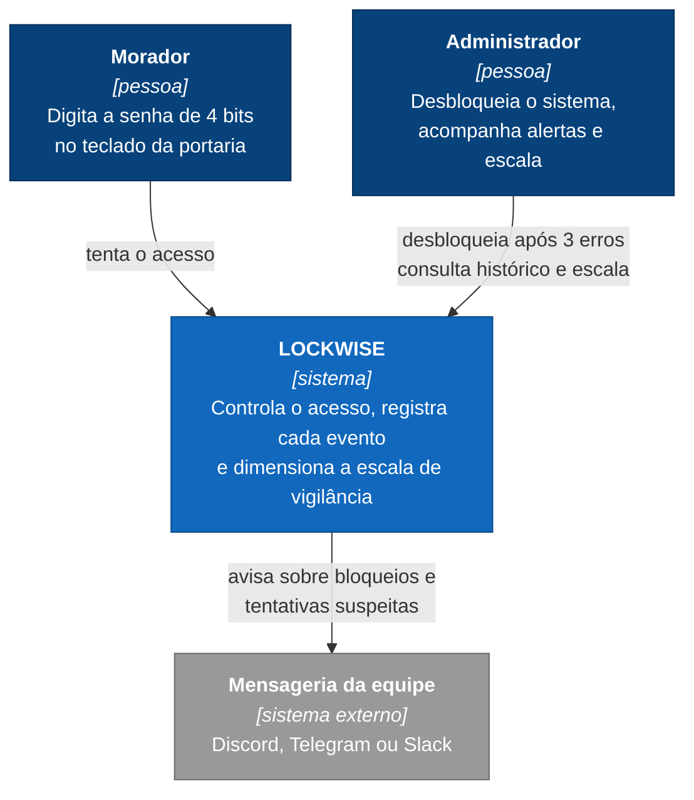
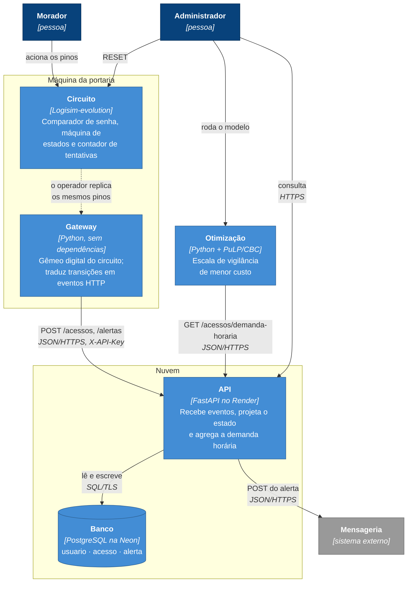
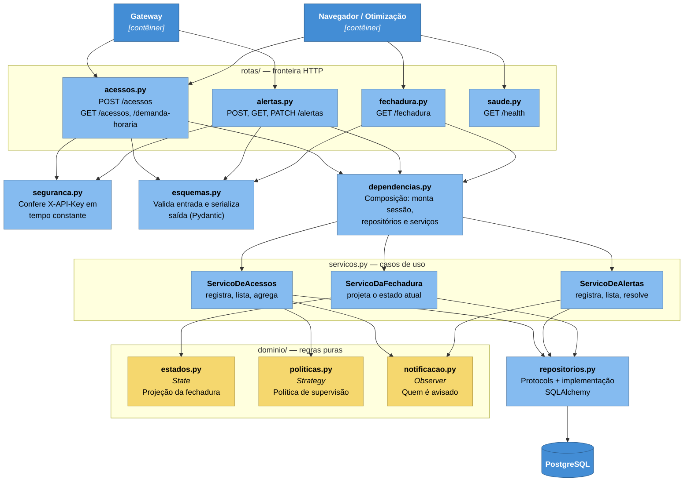
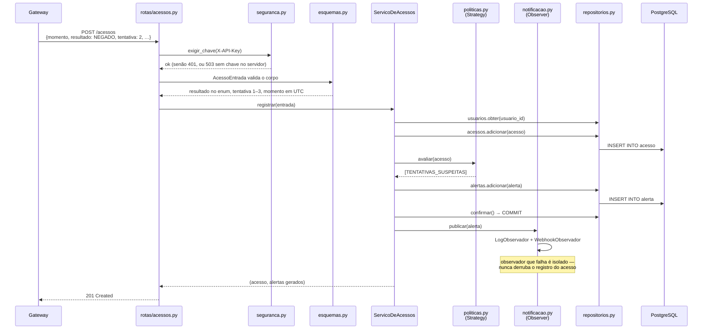
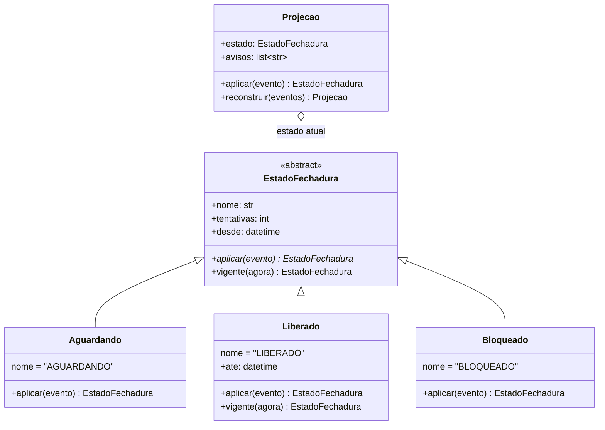

# Arquitetura

Documentação em C4, do contexto ao código, com os padrões de projeto e os princípios SOLID apontando arquivo e linha.

Os diagramas são Mermaid, versionados junto do código: renderizam direto no GitHub e mudam por *pull request*, como qualquer outro arquivo. Diagrama feito em ferramenta gráfica e exportado como imagem se descola do código no primeiro refactor.

---

## Nível 1 — Contexto

Quem usa o LOCKWISE e com o que ele conversa.



O sistema não integra com nenhum serviço de terceiros para funcionar. A mensageria é opcional: sem `LOCKWISE_WEBHOOK_URL` configurada, os alertas vão só para o log.

---

## Nível 2 — Contêiner

As partes que se implantam separadamente e como conversam.



A seta tracejada entre circuito e gateway é a única que não é automática, e é honesta: o Logisim não expõe o estado da simulação para fora, então o operador aciona os mesmos pinos dos dois lados. O que garante que os dois concordam é uma prova por teste, não uma promessa — ver [ADR 0008](adr/0008-gateway-como-gemeo-digital.md) e [ADR 0009](adr/0009-equivalencia-provada-contra-o-circ.md).

---

## Nível 3 — Componentes da API

Dentro do contêiner da API, com as dependências apontando sempre para dentro.



Nenhuma seta sai do `dominio/` para fora. É o que permite testar as regras em milissegundos, sem banco nem rede: os 30 testes do domínio rodam em 0,15 s.

---

## O caminho de uma requisição

`POST /acessos` na segunda tentativa incorreta — o caso em que a política de supervisão dispara.



O `COMMIT` acontece **antes** de notificar. É deliberado: o acesso precisa estar gravado mesmo que o webhook esteja fora do ar.

---

## Nível 4 — Código: o padrão State

O único nível 4 que vale desenhar, porque é a mesma máquina de estados que aparece três vezes no projeto — no circuito, no gateway e aqui.



Duas diferenças em relação à máquina do circuito, ambas deliberadas:

- **Não existe VERIFICANDO.** É transitório de uma borda de clock; a nuvem recebe o resultado, não o meio do caminho.
- **`Liberado` expira sozinho.** O gateway não envia o evento de TIMEOUT, porque a duração é fixa por construção — o NE555 de [`fisica.md §5`](fisica.md). `vigente()` devolve `Aguardando` depois de 5,16 s.

---

## Padrões de projeto

Três padrões GoF, cada um resolvendo um problema que existiria de qualquer forma. O risco conhecido desse requisito é o padrão de enfeite; o critério aqui foi: **o que neste sistema varia?**

| Padrão | Onde | O que varia | Se não existisse |
|---|---|---|---|
| **State** | [`dominio/estados.py:40`](../backend/lockwise_api/dominio/estados.py) — `EstadoFechadura` e as três subclasses; `Projecao:114` | O comportamento diante de um evento muda conforme o estado | Um `if estado == …` repetido em cada método, e a regra de expiração do LIBERADO espalhada |
| **Strategy** | [`dominio/politicas.py:30`](../backend/lockwise_api/dominio/politicas.py) — `PoliticaDeSupervisao` e as quatro implementações | Quando avisar alguém depende do contexto de uso: residência, condomínio, horário comercial | A regra de alerta ficaria dentro de `ServicoDeAcessos`, e trocar exigiria editar o serviço |
| **Observer** | [`dominio/notificacao.py:38`](../backend/lockwise_api/dominio/notificacao.py) — `Observador`, `Notificador:42`, `LogObservador:61`, `WebhookObservador:71` | Quem se interessa por um alerta muda com o tempo | O serviço chamaria o webhook direto e passaria a depender de rede para registrar um acesso |

### O que foi descartado, e por quê

**Factory** — existe uma fábrica ([`politicas.py:110`](../backend/lockwise_api/dominio/politicas.py), `politica_por_nome`), mas é uma função com um dicionário. Chamá-la de padrão seria inflar a contagem.

**Command** — não há desfazer, fila de comandos nem macro. Não teria trabalho.

**Singleton** — a instância única do `Notificador` é garantida pela composição em [`main.py:46`](../backend/lockwise_api/main.py), sem a classe precisar saber disso. Singleton como padrão atrapalha teste e não acrescentaria nada.

Detalhe da mesma família: `Composta` ([`politicas.py:90`](../backend/lockwise_api/dominio/politicas.py)) combina políticas por composição — é um Composite pequeno, mas não o contamos como padrão separado porque é a forma natural de somar duas Strategies.

---

## SOLID, com o dedo na linha

"Aplicamos SOLID" sem evidência não conta. Cada princípio abaixo aponta arquivo e linha.

### S — Responsabilidade única

[`servicos.py`](../backend/lockwise_api/servicos.py) tem **três** classes, não uma: `ServicoDeAcessos:58` registra e agrega acessos, `ServicoDeAlertas:139` cuida de alertas, `ServicoDaFechadura:168` só projeta o estado. Cada uma muda por um motivo diferente.

Fora dos serviços, a mesma disciplina: [`seguranca.py:17`](../backend/lockwise_api/seguranca.py) só autentica; [`config.py`](../backend/lockwise_api/config.py) só lê ambiente; [`esquemas.py`](../backend/lockwise_api/esquemas.py) só valida e serializa.

### O — Aberto para extensão, fechado para modificação

Uma política nova de supervisão é uma classe nova em [`politicas.py`](../backend/lockwise_api/dominio/politicas.py) mais uma entrada no dicionário de `politica_por_nome:110`. **Nenhuma linha de `servicos.py` muda.**

Um observador novo é uma classe com `notificar` e uma chamada a `notificador.assinar()` em [`main.py:47`](../backend/lockwise_api/main.py). O `ServicoDeAcessos` não sabe quantos observadores existem.

A prova está nos testes: `test_politicas.py` exercita quatro políticas diferentes sem tocar no serviço.

### L — Substituição de Liskov

`Projecao.aplicar` ([`estados.py:121`](../backend/lockwise_api/dominio/estados.py)) chama `estado.aplicar(evento)` sem saber qual estado é. `Liberado` sobrescreve `vigente()` para expirar com o tempo, e continua substituível: o contrato — devolver um `EstadoFechadura` válido — é respeitado.

O mesmo em `ServicoDeAcessos.registrar:77`, que chama `self._politica.avaliar(...)` sem distinguir `LimiteDeTentativas` de `Composta` ou `SemSupervisao`.

### I — Segregação de interfaces

[`repositorios.py`](../backend/lockwise_api/repositorios.py) declara **três** Protocols em vez de um repositório genérico: `RepositorioDeAcessos:19`, `RepositorioDeAlertas:26`, `RepositorioDeUsuarios:33`.

`ServicoDaFechadura:168` recebe só os dois de que precisa — acessos e alertas — e não conhece usuários. Um repositório único obrigaria cada serviço a depender de métodos que não usa.

### D — Inversão de dependência

Os serviços recebem **Protocols** no construtor, não classes concretas. Quem injeta a implementação SQLAlchemy é [`dependencias.py:34`](../backend/lockwise_api/dependencias.py).

A verificação mais direta: nenhum arquivo de `dominio/` importa `sqlalchemy` ou `fastapi`.

```bash
grep -rn "sqlalchemy\|fastapi" backend/lockwise_api/dominio/   # não retorna nada
```

A mesma inversão em `UnidadeDeTrabalho` ([`servicos.py:39`](../backend/lockwise_api/servicos.py)): o serviço sabe que precisa confirmar a transação, não que existe uma sessão do SQLAlchemy por trás.

---

## Estilo arquitetural

Arquitetura em camadas com dependências apontando para dentro — o que Robert Martin chama de *Clean Architecture* e Alistair Cockburn, de *ports and adapters*. A regra única: **o de dentro nunca conhece o de fora**.

```
rotas/           ─┐
dependencias.py   │  fora: HTTP, injeção, infraestrutura
repositorios.py  ─┘
       ↓ depende de
servicos.py          casos de uso
       ↓ depende de
dominio/             regras puras — não depende de nada do projeto
```

O que isso compra, concretamente: trocar FastAPI por Flask mexeria em `rotas/` e `dependencias.py`; trocar PostgreSQL por outro banco mexeria em `repositorios.py` e `modelos.py`. Em nenhum dos dois casos o `dominio/` seria tocado.

---

## Decisões registradas

Os porquês estão em [`docs/adr/`](adr/), uma decisão por arquivo. As que moldaram esta arquitetura:

| ADR | Decisão |
|---|---|
| [0008](adr/0008-gateway-como-gemeo-digital.md) | Gateway como gêmeo digital, não integração com o Logisim |
| [0009](adr/0009-equivalencia-provada-contra-o-circ.md) | Equivalência provada por teste, contra o arquivo `.circ` |
| [0014](adr/0014-fastapi-sqlalchemy-sqlite-postgres.md) | FastAPI e SQLAlchemy; SQLite local, Postgres em produção |
| [0015](adr/0015-tres-padroes-gof.md) | Três padrões GoF, cada um com um trabalho real |
| [0016](adr/0016-chave-na-escrita-leitura-aberta.md) | Chave só na escrita; leitura aberta; sem chave, 503 |
| [0017](adr/0017-eventos-inconsistentes-aceitos.md) | Eventos inconsistentes são aceitos e anotados |
| [0022](adr/0022-deploy-gatilhado-pelo-ci.md) | Deploy disparado pelo CI, não pelo push |
| [0024](adr/0024-banco-na-neon.md) | Postgres na Neon, aplicação no Render |
| [0026](adr/0026-modelo-de-cobertura-com-turnos-sobrepostos.md) | Modelo de cobertura com turnos sobrepostos |
