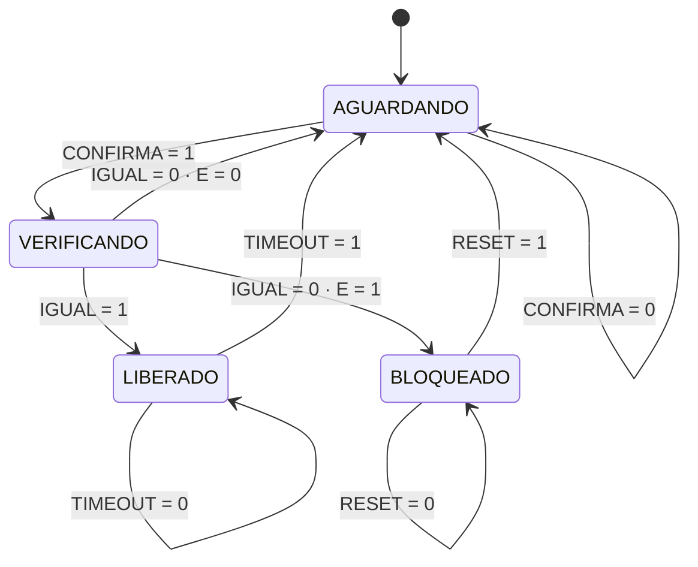

# Projeto do circuito digital

Como o circuito do LOCKWISE foi projetado: da especificação à tabela-verdade, dos mapas de Karnaugh às equações, e das equações às portas que estão no arquivo.

O caminho é o de sempre em eletrônica digital — especificar, tabelar, simplificar, implementar —, e o documento segue essa ordem. As figuras de `docs/evidencias/` vêm depois da teoria, nunca antes.

**Uma garantia sobre este documento:** todas as tabelas aqui foram **extraídas do próprio `circuito/lockwise_completo.circ`** por um leitor de netlist, não transcritas à mão. A tabela condensada de transição de estados foi conferida contra as 256 combinações possíveis do circuito — zero contraexemplos, zero casos não cobertos. O mesmo leitor sustenta os testes de equivalência do gateway ([ADR 0009](adr/0009-equivalencia-provada-contra-o-circ.md)).

---

## 1. Especificação

Uma fechadura eletrônica que:

1. compara uma senha de 4 bits com o valor gravado `1011`;
2. libera a trava quando a senha confere;
3. conta tentativas incorretas consecutivas e bloqueia na terceira;
4. permanece bloqueada até uma intervenção administrativa;
5. fecha a trava sozinha depois de um tempo.

### Entradas e saídas

| Pino | Tipo | Função |
|---|---|---|
| `S3 S2 S1 S0` | entrada | senha digitada, 4 bits |
| `CONFIRMA` | entrada | o usuário submete a senha |
| `TIMEOUT` | entrada | o temporizador avisa que o tempo de trava aberta acabou |
| `RESET` | entrada | desbloqueio administrativo |
| `CLK` | entrada | clock; todas as transições ocorrem na borda de subida |
| `AGUARDANDO` `VERIFICANDO` `TRAVA_ABERTA` `BLOQUEADO` | saída | estado atual, um LED cada |
| `SENHA_OK` | saída | a senha nos pinos confere |
| `ERROS_C1` `ERROS_C0` | saída | contador de tentativas, 2 bits |

`TRAVA_ABERTA` é o **atuador**: aciona o estágio de potência dimensionado em [`fisica.md §4`](fisica.md) — transistor BC337, diodo de roda livre e solenoide de 12 V.

### Composição

| Componente | Quantidade |
|---|---:|
| Portas AND (15 de 2 entradas, 5 de 3) | 20 |
| Portas OR (3 de 2 entradas, 2 de 3) | 5 |
| Portas NOT | 6 |
| Portas XOR | 2 |
| Flip-flops D | 4 |
| Pinos de entrada / saída | 8 / 7 |

Nenhum componente pronto do Logisim: o contador e os registradores de estado são feitos com flip-flops D e portas, para que cada sinal possa ser explicado ([ADR 0003](adr/0003-portas-e-flip-flops-discretos.md)).

---

## 2. Bloco combinacional — o comparador de senha

### 2.1 Tabela-verdade

A saída `IGUAL` vale 1 apenas para a senha gravada. Extraída do circuito:

| # | S3 | S2 | S1 | S0 | IGUAL |
|---:|:--:|:--:|:--:|:--:|:-----:|
| 0 | 0 | 0 | 0 | 0 | 0 |
| 1 | 0 | 0 | 0 | 1 | 0 |
| 2 | 0 | 0 | 1 | 0 | 0 |
| 3 | 0 | 0 | 1 | 1 | 0 |
| 4 | 0 | 1 | 0 | 0 | 0 |
| 5 | 0 | 1 | 0 | 1 | 0 |
| 6 | 0 | 1 | 1 | 0 | 0 |
| 7 | 0 | 1 | 1 | 1 | 0 |
| 8 | 1 | 0 | 0 | 0 | 0 |
| 9 | 1 | 0 | 0 | 1 | 0 |
| 10 | 1 | 0 | 1 | 0 | 0 |
| **11** | **1** | **0** | **1** | **1** | **1** |
| 12 | 1 | 1 | 0 | 0 | 0 |
| 13 | 1 | 1 | 0 | 1 | 0 |
| 14 | 1 | 1 | 1 | 0 | 0 |
| 15 | 1 | 1 | 1 | 1 | 0 |

Forma canônica em soma de produtos: **IGUAL = Σm(11)**.

### 2.2 Mapa de Karnaugh

```
                        S1 S0
              00     01     11     10
           ┌──────┬──────┬──────┬──────┐
     00    │  0   │  0   │  0   │  0   │     m0   m1   m3   m2
           ├──────┼──────┼──────┼──────┤
     01    │  0   │  0   │  0   │  0   │     m4   m5   m7   m6
S3 S2      ├──────┼──────┼──────┼──────┤
     11    │  0   │  0   │  0   │  0   │     m12  m13  m15  m14
           ├──────┼──────┼──────┼──────┤
     10    │  0   │  0   │ (1)  │  0   │     m8   m9   m11  m10
           └──────┴──────┴──────┴──────┘
```

As linhas e colunas seguem o código de Gray (`00 · 01 · 11 · 10`), para que células vizinhas difiram em um único bit — é isso que torna os agrupamentos válidos.

Há um único 1 no mapa, isolado — não existe adjacência para agrupar. O mintermo é irredutível:

```
IGUAL = S3 · S̄2 · S1 · S0
```

Este é o caso em que o mapa de Karnaugh **confirma que não há simplificação possível**, e isso é uma informação útil: qualquer tentativa de reduzir o número de literais estaria errada. Um comparador de igualdade contra uma constante é sempre um único mintermo.

### 2.3 Implementação em dois estágios

A expressão canônica pede um AND de quatro entradas. O circuito usa dois estágios:

```
P1    = S3 · S̄2
P2    = S1 · S0
IGUAL = P1 · P2
```

Álgebra booleana justifica a equivalência pela **associatividade do produto**:

```
S3 · S̄2 · S1 · S0 = (S3 · S̄2) · (S1 · S0)
```

Por que fazer assim, se a expressão é a mesma? Duas razões práticas. O **fan-in** de cada porta cai de quatro para duas entradas, e portas de 2 entradas são o que os CIs comuns da família 74HC oferecem — um 74HC08 traz quatro delas; um AND de 4 entradas exigiria outro CI. E os sinais intermediários `P1` e `P2` ficam nomeados no diagrama, o que torna possível apontar onde a comparação falhou: com a senha `1010`, `P1` vale 1 e `P2` vale 0.

O custo é um nível a mais de propagação, irrelevante aqui (ver §5).

**Evidências:** [`fig03_comparador`](evidencias/fig03_comparador.png) rejeitando senha incorreta, [`fig04_comparador_correto`](evidencias/fig04_comparador_correto.png) reconhecendo `1011`.

---

## 3. Bloco sequencial — a máquina de estados

### 3.1 Estados e codificação

Quatro estados, codificação binária direta em dois flip-flops D:

| Estado | Q1 | Q0 | Significado |
|---|:--:|:--:|---|
| AGUARDANDO | 0 | 0 | repouso, esperando alguém confirmar |
| VERIFICANDO | 0 | 1 | comparando a senha |
| LIBERADO | 1 | 0 | trava acionada |
| BLOQUEADO | 1 | 1 | travado após três erros |

Dois bits bastam para quatro estados, e a codificação binária foi escolhida em vez de *one-hot* porque economiza dois flip-flops e porque a decodificação de cada estado sai em uma porta AND de duas entradas:

```
AGUARDANDO  = Q̄1 · Q̄0        VERIFICANDO = Q̄1 · Q0
LIBERADO    = Q1 · Q̄0        BLOQUEADO   = Q1 · Q0
```

Não há estado não utilizado: as quatro combinações de dois bits têm significado, o que elimina a necessidade de tratar estados inválidos.

### 3.2 Diagrama de estados



`E` é o sinal de limiar do contador, definido na §4.

### 3.3 Tabela de transição

Condensada com "não importa": as entradas que não aparecem numa linha não afetam aquela transição.

| Q1 | Q0 | Estado atual | Condição | D1 | D0 | Próximo estado |
|:--:|:--:|---|---|:--:|:--:|---|
| 0 | 0 | AGUARDANDO | CONFIRMA = 0 | 0 | 0 | AGUARDANDO |
| 0 | 0 | AGUARDANDO | CONFIRMA = 1 | 0 | 1 | VERIFICANDO |
| 0 | 1 | VERIFICANDO | IGUAL = 1 | 1 | 0 | LIBERADO |
| 0 | 1 | VERIFICANDO | IGUAL = 0 · E = 0 | 0 | 0 | AGUARDANDO |
| 0 | 1 | VERIFICANDO | IGUAL = 0 · E = 1 | 1 | 1 | BLOQUEADO |
| 1 | 0 | LIBERADO | TIMEOUT = 0 | 1 | 0 | LIBERADO |
| 1 | 0 | LIBERADO | TIMEOUT = 1 | 0 | 0 | AGUARDANDO |
| 1 | 1 | BLOQUEADO | RESET = 0 | 1 | 1 | BLOQUEADO |
| 1 | 1 | BLOQUEADO | RESET = 1 | 0 | 0 | AGUARDANDO |

> Estas 9 linhas foram verificadas contra as **256 combinações** de (estado × IGUAL × CONFIRMA × TIMEOUT × RESET × contador) avaliadas no circuito: nenhum contraexemplo e nenhuma combinação fora da tabela.

Note que `CONFIRMA` só importa em AGUARDANDO, `TIMEOUT` só em LIBERADO e `RESET` só em BLOQUEADO. É o que torna a máquina simples de operar e de explicar: cada entrada tem um estado onde é relevante.

### 3.4 Equações de excitação

O flip-flop D copia a entrada na borda, então a equação de excitação é o próprio próximo estado: `D1 = Q1(t+1)` e `D0 = Q0(t+1)`.

Lendo a tabela, `D1` vale 1 nas transições para LIBERADO (10) e para BLOQUEADO (11), e nas permanências em LIBERADO e BLOQUEADO:

```
D1 = Q̄1·Q0·(IGUAL + E)  +  Q1·Q̄0·T̄IMEOUT  +  Q1·Q0·R̄ESET
      ↑ VERIFICANDO sai      ↑ LIBERADO          ↑ BLOQUEADO
        para 1_                permanece           permanece
```

`D0` vale 1 nas transições para VERIFICANDO (01) e para BLOQUEADO (11):

```
D0 = Q̄1·Q̄0·CONFIRMA  +  Q̄1·Q0·(ĪGUAL·E)  +  Q1·Q0·R̄ESET
      ↑ AGUARDANDO →        ↑ VERIFICANDO →      ↑ BLOQUEADO
        VERIFICANDO           BLOQUEADO            permanece
```

Os três termos de cada equação correspondem às portas AND de 3 entradas do circuito (`A1 A2 A3` para `D1`; `B1 B2 A3` para `D0`), somadas por uma OR de 3 entradas. O termo `Q1·Q0·R̄ESET` é compartilhado: a mesma porta `A3` alimenta as duas somas, porque permanecer em BLOQUEADO significa manter os dois bits em 1.

**Evidências:** [`fig05_aguardando`](evidencias/fig05_aguardando.png), [`fig06_verificando`](evidencias/fig06_verificando.png), [`fig07_liberado`](evidencias/fig07_liberado.png), [`fig08_retorno-timeout`](evidencias/fig08_retorno-timeout.png).

---

## 4. Bloco sequencial — o contador de tentativas

### 4.1 O que ele precisa fazer

Contar erros consecutivos de 0 a 3, zerar quando o acesso é liberado ou quando o administrador intervém, e **não transbordar** de volta a zero.

### 4.2 Sinais auxiliares

```
ERRO = VERIFICANDO · ĪGUAL          houve erro nesta verificação
E    = C1 · (C0 + ERRO)             limiar de bloqueio, antecipado
CLR  = LIBERADO + RESET             zera o contador
EN   = ERRO · ¬(C1 · C0)            habilita a contagem, com saturação
```

### 4.3 Equações de excitação

Um contador binário crescente incrementa o bit menos significativo a cada pulso e o mais significativo quando o menos significativo transborda:

```
DC0 = (C0 ⊕ EN) · C̄LR
DC1 = (C1 ⊕ (C0 · EN)) · C̄LR
```

O XOR é o incremento: `C0 ⊕ EN` inverte `C0` quando `EN = 1` e o mantém quando `EN = 0`. `C1` inverte quando `C0 · EN` — ou seja, quando o bit de baixo estava em 1 e vai virar, propagando o "vai um". O produto por `C̄LR` força os dois bits a zero quando `CLR = 1`, o que implementa a limpeza síncrona.

### 4.4 Comportamento verificado

Extraído do circuito, todas as combinações de (contador × ERRO × CLR):

| C1 | C0 | ERRO | CLR | DC1 | DC0 | Efeito |
|:--:|:--:|:----:|:---:|:---:|:---:|---|
| 0 | 0 | 1 | 0 | 0 | 1 | incrementa |
| 0 | 1 | 1 | 0 | 1 | 0 | incrementa |
| 1 | 0 | 1 | 0 | 1 | 1 | incrementa |
| **1** | **1** | **1** | **0** | **1** | **1** | **satura — não transborda** |
| 0 | 0 | 0 | 0 | 0 | 0 | mantém |
| 0 | 1 | 0 | 0 | 0 | 1 | mantém |
| 1 | 0 | 0 | 0 | 1 | 0 | mantém |
| 1 | 1 | 0 | 0 | 1 | 1 | mantém |
| × | × | × | 1 | 0 | 0 | zera |

**Evidências:** [`fig09_primeiro-erro`](evidencias/fig09_primeiro-erro.png) (01), [`fig10_segundo-erro`](evidencias/fig10_segundo-erro.png) (10), [`fig11_terceiro-erro-bloqueio`](evidencias/fig11_terceiro-erro-bloqueio.png) (11 + BLOQUEADO), [`fig12_saturacao`](evidencias/fig12_saturacao.png), [`fig13_desbloqueio-administrativo`](evidencias/fig13_desbloqueio-administrativo.png).

---

## 5. As duas decisões que a sabatina vai perguntar

### 5.1 Por que `E = C1·(C0 + ERRO)` e não simplesmente `C1·C0`?

Porque o flip-flop só assume o valor novo **depois** da borda de clock.

No instante do terceiro erro, o contador ainda mostra `10`. Se o sinal de bloqueio fosse `C1·C0`, a máquina de estados leria `E = 0` e iria para AGUARDANDO; o bloqueio só aconteceria na quarta tentativa. O sistema aceitaria uma tentativa a mais do que a especificação manda.

A expressão `C1·(C0 + ERRO)` **antecipa o limiar**: com `C1 = 1` e um erro acontecendo agora, `E` vale 1 na mesma borda em que o contador vai para `11`. Estado e contador mudam juntos, e a fig. 11 mostra os dois: BLOQUEADO aceso com o contador em `11`.

Generalizando: em lógica síncrona, um sinal que depende do valor *futuro* de um registrador precisa ser calculado a partir das entradas, não da saída do registrador.

### 5.2 Por que o contador satura em vez de transbordar?

Um contador binário de 2 bits, ao receber um pulso estando em `11`, volta a `00`. Se isso acontecesse aqui, o bloqueio se desfaria sozinho e o sistema liberaria três novas tentativas — exatamente o oposto do que a especificação pede.

`EN = ERRO · ¬(C1·C0)` resolve: o próprio contador cheio corta a habilitação de contagem.

Na sequência normal isso nunca é exercitado, porque de BLOQUEADO não se chega a VERIFICANDO e, sem VERIFICANDO, não há ERRO. Mas a saturação torna a garantia **local**: ela vale mesmo que uma sequência fora do previsto leve o circuito a esse ponto. Duas portas a mais compram uma propriedade que não depende do resto do circuito estar correto. A fig. 12 registra o caso.

---

## 6. Verificação temporal

### 6.1 Projeto síncrono

Todas as transições ocorrem na borda de subida de `CLK`. As entradas de dados são apenas **amostradas** nessa borda; entre uma borda e outra podem mudar à vontade sem efeito ([ADR 0005](adr/0005-maquina-de-estados-sincrona.md)).

A consequência prática é que pulsos espúrios na lógica combinacional — *glitches*, que aparecem quando várias entradas de uma porta mudam quase ao mesmo tempo — são irrelevantes: eles se extinguem em nanossegundos, muito antes da próxima borda.

### 6.2 Caminho crítico

O caminho mais longo entre dois flip-flops passa pelo sinal de limiar:

```
Q1,Q0 ─▷ AND (VERIFICANDO) ─▷ AND (ERRO) ─▷ OR (C0+ERRO) ─▷ AND (E)
      ─▷ AND (NE) ─▷ AND3 (B2) ─▷ OR3 (D0)
```

Sete níveis de porta. Com os atrasos máximos da família 74HC (`fisica.md §2.4`):

```
t_FF(CLK→Q) + t_lógica + t_setup = 31 + 142 + 20 = 193 ns   →   f_máx ≈ 5,2 MHz
```

O clock do LOCKWISE é acionado manualmente, a menos de 10 Hz. A margem é de mais de 500 000 vezes.

### 6.3 Evidência

O cronograma do Logisim ([`fig14_diagrama`](evidencias/fig14_diagrama.png)) mostra que todas as transições de estado e do contador ocorrem alinhadas às bordas de subida de CLK, e nenhuma entre elas.

---

## 7. Da lógica ao mundo físico

O circuito lógico decide; quem age é o estágio de potência. O memorial [`fisica.md`](fisica.md) dimensiona:

- **entradas** — resistores de pull-down de 10 kΩ, porque a entrada CMOS é um capacitor e, solta, assume qualquer valor (§2.2);
- **clock** — filtro RC de 10 ms e Schmitt-trigger, porque é a única entrada sensível à borda (§2.3);
- **indicadores** — 220 Ω por LED (§3);
- **atuador** — a saída `TRAVA_ABERTA` aciona um BC337 em saturação, que chaveia o solenoide de 12 V / 300 mA, com diodo 1N4007 contra o pico reverso (§4);
- **TIMEOUT** — NE555 monoestável de 5,16 s (§5).

E o número que atravessa todo o projeto: **18 200 mJ por liberação**, gravado em cada evento de acesso e somado por faixa horária no modelo de otimização.

---

## 8. Como reproduzir

```
Logisim-evolution 4.1.0 → Arquivo → Abrir → circuito/lockwise_completo.circ
Selecione o circuito LOCKWISE → Simular → Reiniciar Simulação
```

O roteiro de operação passo a passo está no [README](../README.md#como-operar-o-circuito) e em [`circuito/README.md`](../circuito/README.md).

Para conferir que as tabelas deste documento continuam batendo com o arquivo:

```bash
cd gateway && python -m pytest tests/test_netlist.py -v
```

Esse teste lê o `.circ`, reconstrói a netlist e compara com o modelo em Python nas 2048 combinações de estado e entrada.
